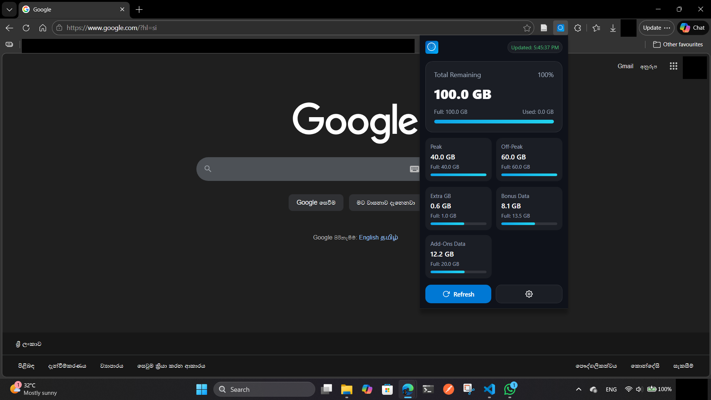
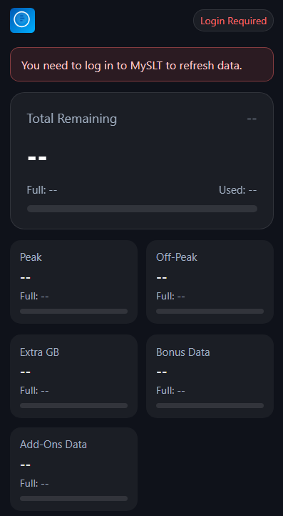
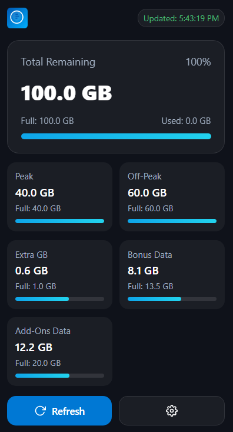
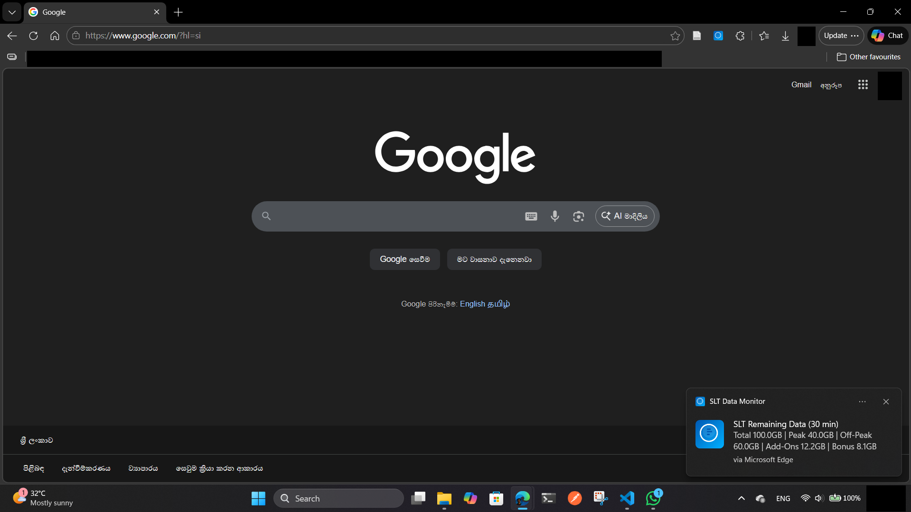
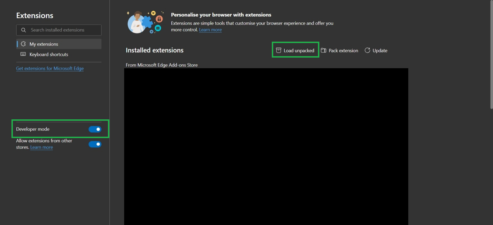

# SLT Data Monitor

SLT Data Monitor is a browser extension for checking MySLT broadband usage quickly from the popup and getting notified when data is running low or specific usage conditions are met.

The extension is designed for the SLT MySLT portal and works by reading usage information from pages on `https://myslt.slt.lk/` inside your browser.




## What it does

- Shows your total remaining data in the extension popup
- Breaks usage into categories such as Peak, Off-Peak, Extra GB, Bonus Data, and Add-Ons Data
- Updates the popup with the latest values after a refresh
- Detects when you are not logged in and shows a login reminder
- Sends notifications for low data, periodic usage updates, and special usage alerts
- Stores usage data locally in the browser

## Screenshots

### Extension installation

### Before login



### After login



### Notifications




## Installation

### Load unpacked in Chrome or Edge



1. Download or clone this repository.
2. Open `chrome://extensions` in Chrome or `edge://extensions` in Edge.
3. Enable Developer mode.
4. Click **Load unpacked**.
5. Select the root folder of this repository.

After installation, open the extension popup and log in to MySLT if needed. Once logged in, the extension can refresh and show the latest usage values.

## Usage

1. Open the extension popup from the browser toolbar.
2. If MySLT is not logged in, the popup will show a login reminder.
3. Log in to MySLT and return to the popup.
4. Click **Refresh** to fetch the latest usage data.
5. Use **Settings** to change the low data alert threshold.

## Notifications

The extension can show different notification types depending on the current data state:

- Low data alert when remaining usage drops below the configured threshold
- Login reminder when the MySLT session appears to be logged out
- Periodic status updates with a summary of remaining data
- Peak data milestone alerts
- Add-Ons Data almost finished alerts
- Bonus Data finished alerts
- Exhausted data alerts for specific usage categories

Clicking a notification can open the relevant MySLT page.

## Project Structure

- `manifest.json` - extension manifest and permissions
- `popup.html` - popup UI
- `popup.js` - popup logic
- `style.css` - popup styles
- `background.js` - background service worker, scraping, and notifications
- `content_script.js` - page scraping helper logic
- `icons/` - extension icons
- `privacy_policy.md` - privacy policy template
- `README-PACKAGING.md` - packaging and publishing notes
- `publish_checklist.md` - release checklist

## Packaging

Use the helper script to create a release zip:

```powershell
cd G:\slt-extension
.\package-extension.ps1
```

See `README-PACKAGING.md` for the full packaging and publishing checklist.

## Privacy

This extension only reads MySLT usage data inside the user's browser and stores values locally in `chrome.storage.local`. It does not send personal data to an external server.

For publishing, use the template in `privacy_policy.md` and update it to match your final listing details.

## License

See `LICENSE` for details.
